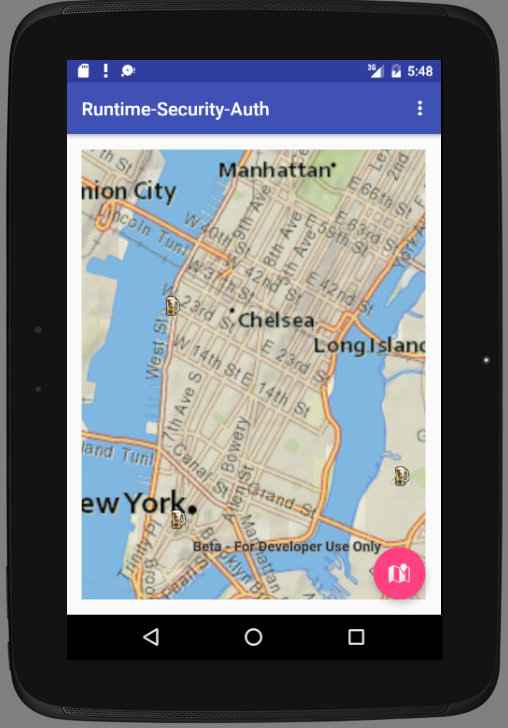

# quickstart-app-android

This is an example template. Use this to set up a new repository on github. Learn more [here](http://developers.arcgis.com/).

## Features
* Basemaps - Set different basemaps interactively
* Geolocation - Find and display your geolocation
* Place Finding - Find places or geocode an address
* Directions - Get directions
* Graphics - Draw points, lines and polygons
* Cloud - Draw and query features stored in the ArcGIS Online cloud

## Instructions

1. Fork and then clone the repo. 
2. Install the prerequsites.
2. Follow the install and setup instructions.
3. Build and test the project.
4. Make your own modifications!

## Requirements

* Review system requirements.
* Basic programming knowledge.

## Resources

* [ArcGIS for Developers](http://developers.arcgis.com/)
* [ArcGIS Blog](http://blogs.esri.com/esri/arcgis/)
* [twitter@geoplay9](http://twitter.com/geoplay9)

## Issues

Find a bug or want to request a new feature?  Please let us know by submitting an issue in this repo.

## Contributing

Esri welcomes contributions from anyone and everyone. Please see our [guidelines for contributing](https://github.com/esri/contributing).

## Licensing
Copyright 2016 Esri

Licensed under the Apache License, Version 2.0 (the "License");
you may not use this file except in compliance with the License.
You may obtain a copy of the License at

   http://www.apache.org/licenses/LICENSE-2.0

Unless required by applicable law or agreed to in writing, software
distributed under the License is distributed on an "AS IS" BASIS,
WITHOUT WARRANTIES OR CONDITIONS OF ANY KIND, either express or implied.
See the License for the specific language governing permissions and
limitations under the License.

A copy of the license is available in the repository's [license.txt](license.txt) file.

​
